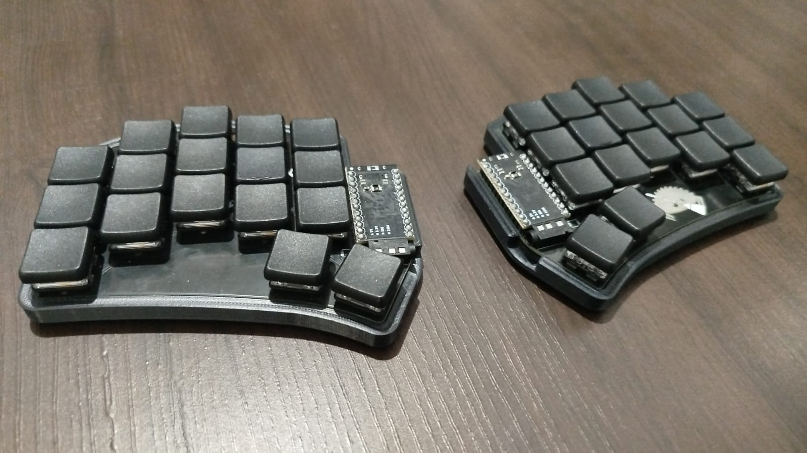
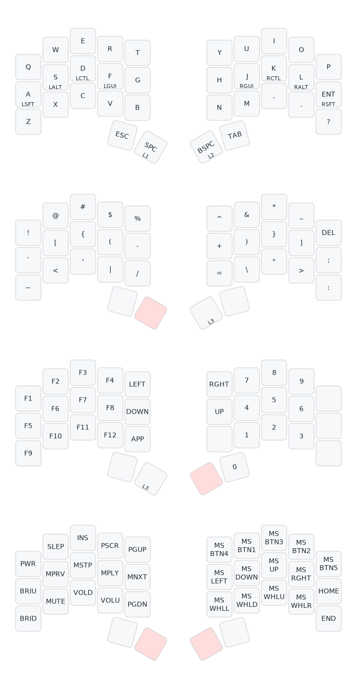

# flpdorea's Sweep 34 keys layout



This repository nests my own layout for the [Sweep](https://github.com/davidphilipbarr/Sweep) split ergonomic keyboard.

Files here are primarly meant only for my own personal use, but feel free to use it as an inspiration or however you wish.

## Key Features

- **34-Key Layout:** A compact layout for minimal hand movement.
- **Home Row Mods:** Common modifiers (Shift, Alt, Ctrl, Gui) are on the home row keys for quick access without leaving the home position.
- **Thumb Cluster Layers:** The two primary thumb keys activate Layer 1 (Symbols) and Layer 2 (Numbers/Navigation), making layer switching fast and intuitive.
- **Dedicated Layers:** Separate layers for Symbols, Numbers/Navigation, and System/Mouse controls for a clean and organized layout.

## Layers

### Layer 0: Base Layer (QWERTY)
This is the default layer with a standard QWERTY layout and Home Row Mods.
- **Tap:** Standard letter.
- **Hold:** Corresponding modifier (e.g., holding `A` produces Left Shift).

### Layer 1: Symbols (Hold Left Thumb)
Activated by holding the left thumb key (`Space`). This layer provides easy access to common programming symbols.

### Layer 2: Numbers & Navigation (Hold Right Thumb)
Activated by holding the right thumb key (`Backspace`). This layer features a numpad on the right hand and arrow keys/F-keys on the left.

### Layer 3: System & Mouse Control
Activated from Layer 1 or 2. This layer contains media controls (volume, play/pause), mouse keys, and system functions like sleep and power.

## Diagram



## How to Use

1.  **Set up your QMK environment:** Follow the QMK Tutorial.
2.  **Compile the firmware:** Place the `keymap.json` in your QMK user folder (e.g., `qmk_firmware/users/flpdorea/keymap.json`) and run:
    ```bash
    qmk compile -kb ferris/sweep -km flpdorea
    ```
3.  **Flash the keyboard:** Follow the standard flashing instructions for your Sweep keyboard.

## Acknowlegments

Special thanks to:
- The **QMK Firmware** collaborators.
- **David Philip Barr** for designing the Sweep keyboard.
- **Caksoylar** for creating [keymap-drawer](https://github.com/caksoylar/keymap-drawer), the tool used to generate the layout diagram.
